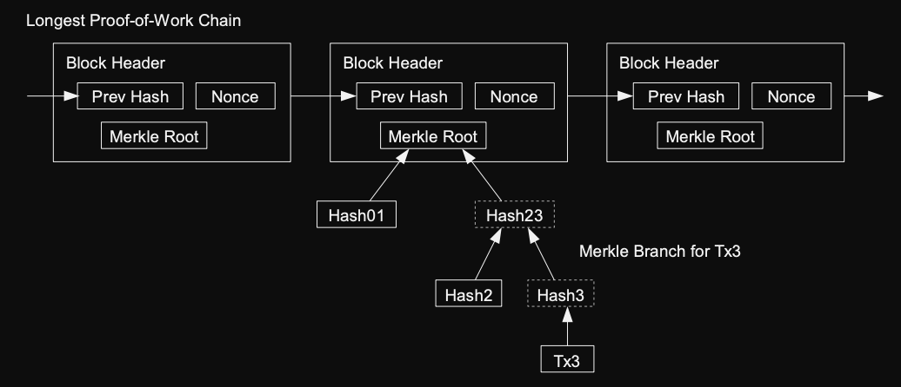

# 08. Simplified Payment Verification

It is possible to verify payments without running a full network node. A user only needs to keep a copy of the block headers of the longest proof-of-work chain, which he can get by querying network nodes until he's convinced he has the longest chain, and obtain the Merkle branch linking the transaction to the block it's timestamped in. He can't check the transaction for himself, but by linking it to a place in the chain, he can see that a network node has accepted it, and blocks added after it further confirm the network has accepted it.

As such, the verification is reliable as long as honest nodes control the network, but is more vulnerable if the network is overpowered by an attacker. While network nodes can verify transactions for themselves, the simplified method can be fooled by an attacker's fabricated transactions for as long as the attacker can continue to overpower the network. One strategy to protect against this would be to accept alerts from network nodes when they detect an invalid block, prompting the user's software to download the full block and alerted transactions to confirm the inconsistency. Businesses that receive frequent payments will probably still want to run their own nodes for more independent security and quicker verification.