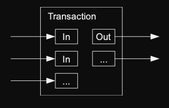

# 09. Combining and Splitting Value

Although it would be possible to handle coins individually, it would be unwieldy to make a separate transaction for every cent in a transfer. To allow value to be split and combined, transactions contain multiple inputs and outputs. Normally there will be either a single input from a larger previous transaction or multiple inputs combining smaller amounts, and at most two outputs: one for the payment, and one returning the change, if any, back to the sender. 

It should be noted that fan-out, where a transaction depends on several transactions, and those transactions depend on many more, is not a problem here. There is never the need to extract a complete standalone copy of a transaction's history.